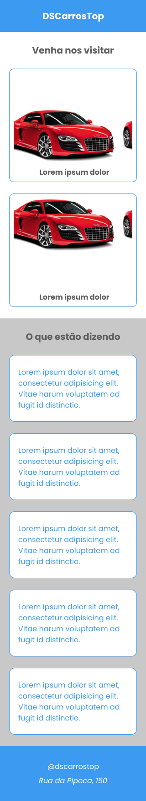
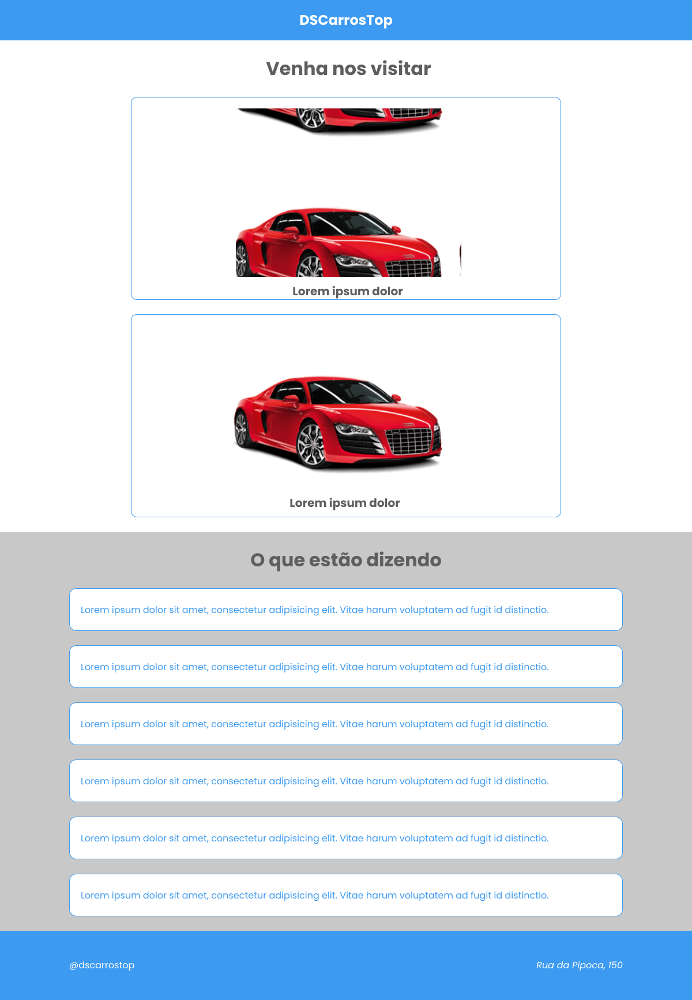

# DSCarrosTop

## Sobre o Projeto

O projeto `DSCarrosTop` é um catálogo de carros desenvolvido como parte do treinamento de reciclagem e aprimoramento em React, TypeScript e Vite chamado **"ReactJS Professional"**, oferecido pela escola [DevSuperior](https://devsuperior.com.br). Este projeto tem como foco principal a fixação de conceitos em "Componentes" e "Rotas" no desenvolvimento frontend. Embora o projeto se concentre na montagem da estrutura, ele é projetado para ser uma página única. O projeto foca na montagem da estrutura, sem se preocupar com os links, resultando em uma página responsiva.

## Estrutura Básica do Projeto

A estrutura do projeto é modular, o que facilita tanto a manutenção quanto a escalabilidade do código. Cada componente e rota tem sua própria pasta, contendo um arquivo `index.tsx` para o código do componente e um arquivo `styles.css` para os estilos.

```
DSCarrosTop/
├── src/
│   ├── components/
│   │   ├── Header/
│   │   │   ├── index.tsx
│   │   │   └── styles.css
│   │   ├── CarCard/
│   │   │   ├── index.tsx
│   │   │   └── styles.css
│   │   ├── CommentCard/
│   │   │   ├── index.tsx
│   │   │   └── styles.css
│   │   └── Footer/
│   │       ├── index.tsx
│   │       └── styles.css
│   ├── routes/
│   │   ├── Home/
│   │   │   ├── index.tsx
│   │   │   └── styles.css
│   ├── App.tsx
│   ├── index.tsx
│   └── index.css
├── package.json
└── vite.config.ts
└── ...
```

# Elementos CSS para Responsividade

1. **Media Queries**: Para adaptar o layout a diferentes tamanhos de tela.
    ```css
    @media (max-width: 768px) {
        /* Seu CSS aqui */
    }
    ```
2. **Flexbox ou Grid Layout**: Para criar layouts flexíveis e responsivos.
    ```css
    .container {
        display: flex;
    }
    ```
    ou
    ```css
    .container {
        display: grid;
    }
    ```
3. **Unidades Relativas**: Use `em`, `rem`, `%`, `vw`, `vh` em vez de unidades fixas como `px`.
    ```css
    font-size: 1.2rem;
    ```
4. **Overflow**: Para lidar com o conteúdo que pode sair dos limites do container.
    ```css
    overflow-x: auto;
    ```
5. **Aspect Ratio**: Manter a proporção de aspecto de elementos como imagens.
    ```css
    aspect-ratio: 16 / 9;
    ```
6. **Min e Max Width/Height**: Definir limites para que os elementos não fiquem muito pequenos ou grandes.
    ```css
    min-width: 300px;
    max-width: 1200px;
    ```

## Interface Responsiva para Mobile

Aqui está uma prévia de como o projeto `DSCarrosTop` se parece em dispositivos móveis. O layout é otimizado para telas pequenas, garantindo uma excelente experiência do usuário.

<div align="center">
  
</div>

## Interface Responsiva para Desktop

Abaixo está uma prévia do projeto em uma visão web padrão. O layout se adapta para aproveitar o espaço da tela, tornando o projeto igualmente eficaz em dispositivos desktop.

<div align="center">
  
</div>